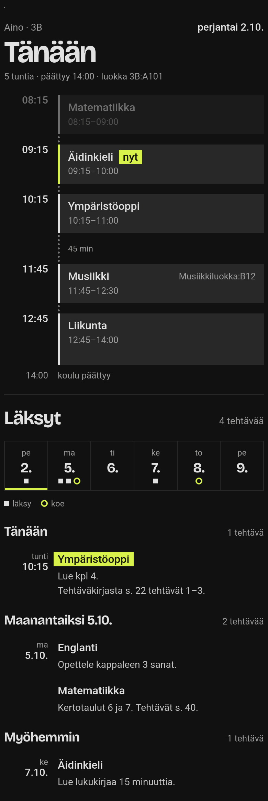
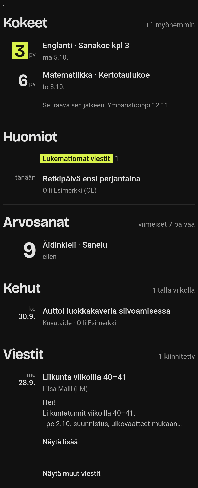

# Wilma-kortti Home Assistantiin

Lapsen koulupäivä yhdellä silmäyksellä: lukujärjestys aikajanana, läksyt, kokeet,
Wilma-viestit, arvosanat ja kehut.

<p>
  
  
</p>

## Wilma-integraatio

Kortti lukee Wilma-integraation sensoreita. Asenna integraatio ensin ja lisää Wilma-tilisi.

| Integraatio | Kortin ominaisuudet |
|---|---|
| [Tubbs10/ha-wilma](https://github.com/Tubbs10/ha-wilma) 1.2.13 tai uudempi | Kaikki |
| [mniittymaki/ha-wilma](https://github.com/mniittymaki/ha-wilma) 1.2.10 | Kaikki paitsi alla luetellut |

[](https://my.home-assistant.io/redirect/hacs_repository/?owner=Tubbs10&repository=ha-wilma&category=integration)

Alkuperäisen integraation (mniittymaki/ha-wilma) kanssa puuttuvat:

- **Viestit-osio:** viestien lukeminen kortissa ja kiinnittäminen. Asetuksen `pinned` säännöllä
  kiinnitetystä viestistä näkyy otsikko, lähettäjä ja päivä.
- **Kehun päivämäärä ja huomautukset** kouluissa, joiden Wilmasta alkuperäinen integraatio
  ei saa tuntimerkinnän päivämäärää. Kortti näyttää huomautuksista viimeisen viikon merkinnät,
  joten päiväämätön merkintä jää pois.
- **Aiemmat huomautukset.** Viikkoa vanhemmat huomautukset avattavana listana.
- **Päivätty lukujärjestys.** Kun lukujärjestys vaihtuu jakson vaihtuessa, alkuperäisen
  integraation kanssa samaan aikaan voi näkyä kaksi tuntia: vanhan ja uuden jakson.

## Asennus

[](https://my.home-assistant.io/redirect/hacs_repository/?owner=Tubbs10&repository=ha-wilma-card&category=plugin)

1. Paina yllä olevaa nappia ja lisää repo HACSiin.
2. Paina **Lataa**.
3. Lataa selainsivu uudelleen.

<details>
<summary>Ilman HACSia</summary>

1. Lataa [uusimman julkaisun](https://github.com/Tubbs10/ha-wilma-card/releases/latest) lähdekoodi ja kopioi
   `dist/`-hakemiston tiedostot HA:n hakemistoon `/config/www/wilma-card/`.
2. **Asetukset → Dashboardit → ⋮ → Resurssit → Lisää resurssi**:
   `/local/wilma-card/wilma-card.js`, tyyppi **JavaScript-moduuli**.
3. Lataa selainsivu uudelleen. Päivityksen jälkeen lisää osoitteen perään esimerkiksi `?v=2`,
   jotta selain hakee uuden version.

</details>

## Käyttö

1. Avaa dashboard muokkaustilaan ja paina **Lisää kortti**.
2. Valitse **Wilma**.
3. Valitse lapsi.

Yhden lapsen perheessä kortti löytää lapsen itse. Useammalle lapselle lisätään oma kortti
jokaiselle.

## Asetukset

Kaikki asetukset ovat valinnaisia. Kaksi ensimmäistä löytyvät kortin editorista, loput
lisätään YAML-näkymässä.

| Asetus | Selitys |
|---|---|
| `device` | Lapsi. Valitaan editorin pudotusvalikosta. |
| `title` | Teksti otsikon yläpuolella. Oletus on lapsen etunimi ja luokka. |
| `child` | Lapsen nimi tekstinä `device`-asetuksen sijaan, esim. `Aino Esimerkki`. |
| `subjects` | Koulun omat ainekoodit, joita kortti ei tunnista valmiiksi. |
| `strip_suffixes` | Tunnisteet, jotka poistetaan tuntimerkinnän lopusta. |
| `pinned` | Säännöt, joilla Wilma-viesti kiinnitetään. Ks. [Viestit ja kiinnittäminen](#viestit-ja-kiinnittäminen). |

```yaml
type: custom:wilma-card
child: Aino Esimerkki
subjects:
  KO: Kotitalous
strip_suffixes:
  - XYZ        # "Kotitehtävät tekemättä, XYZ" näkyy muodossa "Kotitehtävät tekemättä"
```

## Viestit ja kiinnittäminen

Kortin lopussa on osio **Viestit**. Kiinnitetyt viestit näkyvät siinä aina, ja
**Näytä viestit** avaa listan uusimmista Wilma-viesteistä.

- **Kiinnitä** nostaa viestin näkyviin, **Poista kiinnitys** laskee sen takaisin listaan.
  Kiinnitys tallentuu Wilma-integraatioon, joten se näkyy kaikilla laitteilla ja käyttäjillä.
- Viestin teksti näkyy kolmen rivin esikatseluna, ja **Näytä lisää** avaa koko viestin
  vastauksineen.
- Lukemattomalla viestillä ja listan viesteillä on painike **Lue viesti**: sisältö haetaan
  vasta siitä, koska Wilma merkitsee viestin luetuksi, kun sen sisältö haetaan.

Toistuvan viestin voi kiinnittää säännöllä kortin asetuksissa. Sääntö näyttää aina uusimman
siihen sopivan viestin, joten esimerkiksi viikoittainen viesti vaihtuu itsestään:

```yaml
type: custom:wilma-card
pinned:
  - subject: Liikunta          # uusin viesti, jonka otsikossa on "liikunta"
  - sender: Esimerkki          # uusin viesti tältä lähettäjältä
  - subject: Retki
    sender: Esimerkki          # molempien ehtojen pitää täyttyä
  - id: 1234567                # yksittäinen viesti, pysyy kunnes poistat rivin
```

Kirjainkoolla ei ole väliä. Säännöllä kiinnitetty viesti poistetaan poistamalla sääntö.

Osio käyttää integraation [Tubbs10/ha-wilma](https://github.com/Tubbs10/ha-wilma) toimintoja
`wilma.get_message`, `wilma.pin_message` ja `wilma.unpin_message` sekä **Uudet viestit**
-sensorin attribuutteja `messages` ja `pinned`.

## Mitä kortti näyttää

- **Koulupäivä.** Koulupäivän aikana kuluva päivä, sen jälkeen seuraava koulupäivä.
  Tunnit ovat kestonsa korkuisia ja tauot näkyvät niiden väleinä. Käynnissä oleva tunti on merkitty.
- **Läksyt.** Otsikon alla viikkorivi: kuluva tai seuraava koulupäivä ja sitä seuraavat
  koulupäivät, neliö on läksy ja rengas koe. Sen alla läksyt kolmessa ryhmässä:
  - **Tänään.** Näkyy siihen asti, kun aineen tunti alkaa.
  - **Huomiseksi** (tai seuraavaksi koulupäiväksi) ja **Myöhemmin.** Palautuspäivä on
    aineen seuraava tunti.
- **Kokeet** kahden viikon sisällä ja päivät niihin.
- **Huomiot.** Lukemattomat Wilma-viestit, selvitettävät tuntimerkinnät, huomautukset ja
  tiedotteet. Osio näkyy, kun siinä on sisältöä.
- **Arvosanat** viimeiseltä viikolta.
- **Kehut** päivämäärän, aineen ja opettajan kanssa.
- **Aiemmat huomautukset.** Viikkoa vanhemmat huomautukset ovat yhden rivin takana ja
  aukeavat painamalla.
- **Viestit.** Kiinnitetyt viestit ja avattava lista uusimmista viesteistä.

Keltavihreä korostus kertoo, mikä on seuraavaksi edessä. Muut värit tulevat Home Assistantin
teemasta, joten kortti toimii tummassa ja vaaleassa teemassa.

## Kehitys ja lisenssit

Testit: `node --test test/`. Kuvien data on keksittyä.

Koodi: [MIT](LICENSE). Otsikkofontti Bricolage Grotesque:
[SIL Open Font License 1.1](dist/bricolage-grotesque-OFL.txt). Fontti on mukana tiedostona,
joten kortti toimii ilman ulkoisia palvelimia.
